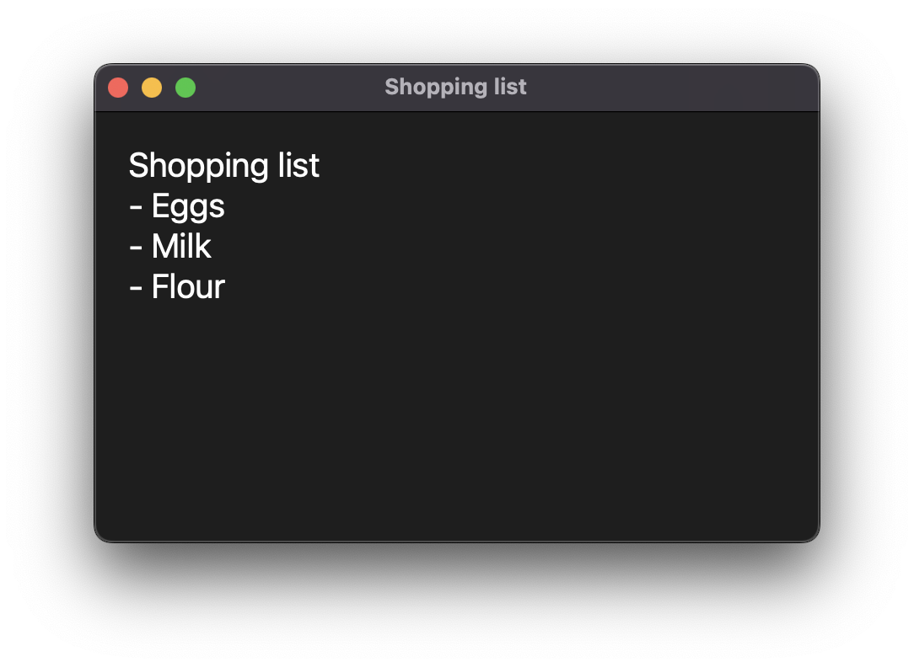

# YAQN - Yeet Another Quick Note
> A fast, easy and OOTB app for taking your notes



## Installation
```
pip install yaqn  # Install from pypi
yaqn --check # Run the app and generate the config file
```

## Configuration
Your configuration file is saved in:
- Unix-like `~/.config/yaqn/config.toml`
- Windows `%AppData%\yaqn\config.toml`

After you run `yaqn --check` your config file will look like this:
```
# This change depending of the OS
notes_path = '/Users/kutu-dev/Documents/notes'
extension = 'md'
```